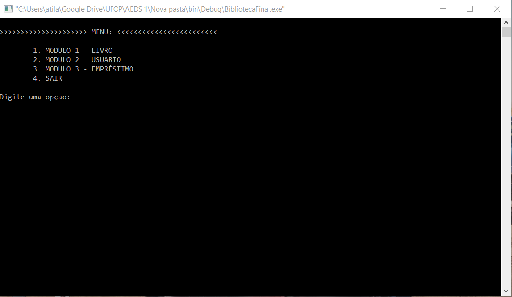

<h1 align="center">
    
</h1>

<h4 align="center">
  🎓 Trabalhos realizados durante a aula de Algoritmos e estruturas de dados UFOP 
</h4>

 

  

  <a href="#rocket-tecnologias">Tecnologias</a>&nbsp;&nbsp;&nbsp;|&nbsp;&nbsp;&nbsp;
  <a href="#-projeto">Projeto</a>&nbsp;&nbsp;&nbsp;|&nbsp;&nbsp;&nbsp;
  <a href="#-layout">Layout</a>&nbsp;&nbsp;&nbsp;|&nbsp;&nbsp;&nbsp;
  <a href="#-como-contribuir">Como contribuir</a>&nbsp;&nbsp;&nbsp;|&nbsp;&nbsp;&nbsp;
  <a href="#memo-licença">Licença</a>

 

  

## :rocket: Tecnologias

Esse projeto foi desenvolvido com as seguintes tecnologias:

- [C]

## 💻 Projeto

Atividades e trabalhos realizados durante o segundo periodo de Sistemas de Informacao. Sendo o trabalho final um sistema para registro e aluguel de livros na biblioteca.

---

Feito com ♥ em durante meu curso com a ajuda de Deiversom e Matheus sob a tutoria do Professor Alexandre Magno
